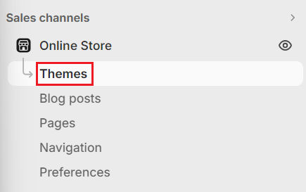
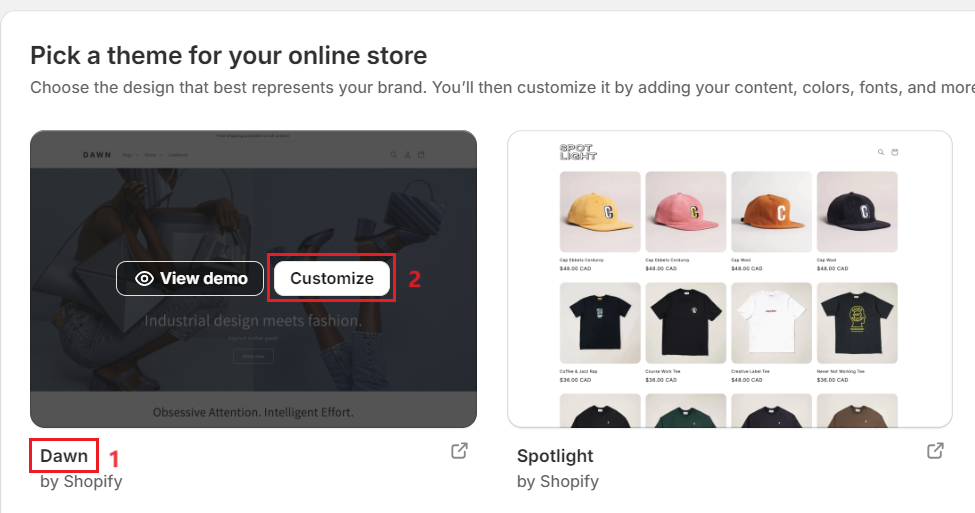
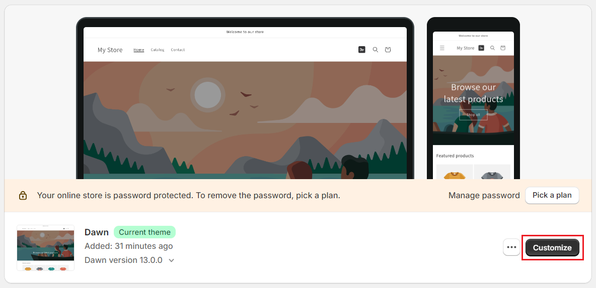
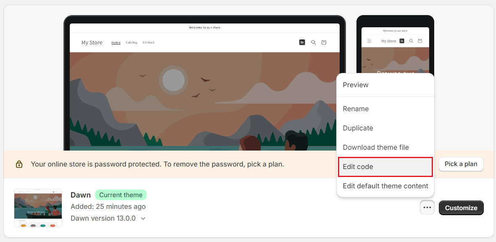
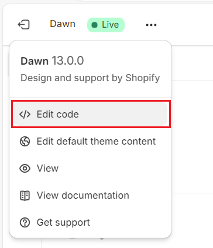
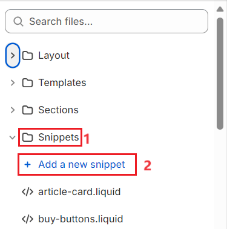

# Integrating Dynamsoft Barcode Reader SDK into Shopify Store

This guide provides step-by-step instructions on integrating the Dynamsoft Barcode Reader SDK JavaScript Edition into a Shopify store.

Dynamsoft Barcode Reader JavaScript Edition (DBR-JS) comes with industry-leading algorithms for exceptional speed, accuracy, and read rates in barcode reading. Utilizing its well-designed API, you can turn your web page into a barcode scanner with just a few lines of code. Once the DBR-JS SDK is integrated into your web page, users can access a camera via the browser and read barcodes directly from its video input.

The sample code in this guide is tailored for Shopify and introduces the following functionalities to a Shopify store:

1. Adds a new barcode scanning icon next to the search icon.
2. Allows users to click on the icon, opening the camera view for barcode scanning within the Shopify store.
3. If a barcode is found and decoded, the user will be redirected to the search page, looking for products which have the decoded product code listed in the product description.

## Prerequisites and Limitations:

- A Shopify web store.
- All the sample code was created based on the Dawn theme version 13.0.0. It is not guaranteed to work with other versions and themes.
- It is recommended to create a new store using the Dawn theme to evaluate the sample code before modifying your production site.
- The key `DLS2eyJvcmdhbml6YXRpb25JRCI6IjIwMDAwMSJ9` specified in the sample code serves as a test license valid for 24 hours, applicable to any newly authorized browser. To test the SDK further, you can request a [30-day free trial license via the Dynamsoft website](https://www.dynamsoft.com/customer/license/trialLicense?ver=10.0.20&utm_source=shopify&product=dbr&package=js).
- Basic understanding of HTML/CSS/JavaScript/Shopify development is required for customization.

## Step 1:
Go to Shopify Admin, select "Online Store" on the left pane, and choose "Themes".



If you are creating a new store, select the theme "Dawn" by clicking the "Customize" button.



If you already have an exisiting theme, you can click "Customize" on the "Current Theme".



You can also click the three dots (...) to the left of the "Customize" button and **skip Step 2**.



## Step 2:
In the "Customize Dawn" page, click the three dots (...) button at the top left, and select "Edit code" from the menu.



## Step 3:
Expand "Snippets" on the left pane, and add the following two files. Don't forget to hit the "Save" button after editing the files.



### `dbr-icon.liquid`
This snippet adds a clickable barcode scanning icon next to the search icon.

> The asset file "dbr-icon.png" will be added in [Step 6](#step-6).

```html
<!-- Stylesheet for Dbr icon -->
<style>
  #dbr-icon {
    cursor: pointer;
    display: inline-flex;
    margin-top: 10px;
    margin-right: 15px;
  }

  #dbr-icon img {
    height: 24px;
    width: 24px;
  }
</style>

<!-- Placement of Dbr icon -->
<!-- The function "startDetection()" is defined in dbr.liquid -->
<div id="dbr-icon" onclick="startDetection()">
  
</div>
```

### `dbr.liquid`
This snippet initializes the Dynamsoft Barcode Reader SDK to perform barcode scanning. It will redirect the user to the search page when a barcode has been found and decoded.

> The asset file "dce.ui.liquid" will be added in [Step 6](#step-6).

```html
<style>
  #cameraViewContainer {
    position: fixed;
    top: 124px;
    left: 0px;
    width: 100%;
    height: 720px;
    display: none;
    z-index: 1000;
  }

  @media only screen and (max-width: 768px) {
    #cameraViewContainer {
      top: 103px;
    }
  }
</style>

<div id="cameraViewContainer"></div>

<script>

  const cameraViewContainer = document.querySelector("#cameraViewContainer")
  let router = null;
  let cameraEnhancer;
  let isInitialized = false;

  async function initialize() {
    if (!isInitialized) {
      // initialize license
      Dynamsoft.License.LicenseManager.initLicense("DLS2eyJvcmdhbml6YXRpb25JRCI6IjIwMDAwMSJ9");

      // preload the libraries
      Dynamsoft.Core.CoreModule.loadWasm(["DBR"]);

      // Create a `CaptureVisionRouter` instance
      router = await Dynamsoft.CVR.CaptureVisionRouter.createInstance();

      // Create a `CameraEnhancer` instance for camera control and a `CameraView` instance for UI control.
      let view = await Dynamsoft.DCE.CameraView.createInstance("{{ 'dce.ui.liquid' | asset_url }}");
      cameraEnhancer = await Dynamsoft.DCE.CameraEnhancer.createInstance(view);
      cameraViewContainer.append(view.getUIElement());

      // Set `CameraEnhancer` instance as its image source.
      router.setInput(cameraEnhancer);

      // Define a callback for results.
      router.addResultReceiver({ onDecodedBarcodesReceived: (result) => {
        if (result.barcodeResultItems.length > 0) {
          window.location = window.location.origin + '/search?q=' + result.barcodeResultItems[0].text;
        }
      }});

      // Filter out unchecked and duplicate results.
      let filter = new Dynamsoft.Utility.MultiFrameResultCrossFilter();
      filter.enableResultCrossVerification(
        Dynamsoft.Core.EnumCapturedResultItemType.CRIT_BARCODE, true
      );
      filter.enableResultDeduplication(
        Dynamsoft.Core.EnumCapturedResultItemType.CRIT_BARCODE, true
      );
      await router.addResultFilter(filter);
      isInitialized = true;
    }
  }

  // Display camera view, open camera and start scanning single barcode.
  async function startDetection() {
    await initialize();
    if (cameraViewContainer.style.display == "inline") {
      cameraViewContainer.style.display = "none";
      await cameraEnhancer.close();
    } else {
      cameraViewContainer.style.display = "inline";
      await cameraEnhancer.open();
      await router.startCapturing("ReadSingleBarcode");
    }
  }

</script>
```

### Step 4:
Expand "Layout" on the left pane, select `theme.liquid`, and add the following lines of code as the first line within the `<head></head>` and the `<body></body>` section respectively:

> Don't forget to hit the "Save" button after editing the file.

```html
  <head>
    <script src="https://cdn.jsdelivr.net/npm/dynamsoft-barcode-reader@10.0.21/dist/dbr.bundle.js"></script>
    <!-- ... (existing head content) -->
  </head>
```
```html
  <body class="gradient animate--hover-{{ settings.animations_hover_elements }}">
    
    <!-- ... (existing body content) -->
  </body>
```

## Step 5:
Expand "Sections" on the left pane, go to `header.liquid`, and add the following line of code (at line 296) on top of `header-search`:

> Don't forget to hit the "Save" button after editing the file.

```html
<!--- Add the following line to include dbr-icon.liquid into header -->

<!-- ... (remaining HTML content) -->

```

## Step 6:
Expand "Assets" on the left pane, and add the following two files:

> Both files can be found in this repository under "/Assets/".

### `dbr-icon.png`
This is the icon file. Simply upload this file or any icon you prefer. Ensure to update `dbr-icon.liquid` with the correct filename, size, and CSS styles.

### `dce.ui.liquid`
This file defines the UI of the CameraView instance. Feel free to modify the settings according to your preferences and then upload the file.

```html
<template>
	<div style="position:relative;width:100%;height:100%;min-width:100px;min-height:100px;background:#ddd;">
		<svg class="dce-bg-loading"
			style="display:none;position:absolute;left:0;top:0;right:0;bottom:0;margin:auto;width:40%;height:40%;fill:#aaa;animation:1s linear infinite dce-rotate;"
			viewBox="0 0 1792 1792">
			<path d="M1760 896q0 176-68.5 336t-184 275.5-275.5 184-336 68.5-336-68.5-275.5-184-184-275.5-68.5-336q0-213 97-398.5t265-305.5 374-151v228q-221 45-366.5 221t-145.5 406q0 130 51 248.5t136.5 204 204 136.5 248.5 51 248.5-51 204-136.5 136.5-204 51-248.5q0-230-145.5-406t-366.5-221v-228q206 31 374 151t265 305.5 97 398.5z" />
		</svg>
		<svg class="dce-bg-camera"
			style="display:none;position:absolute;left:0;top:0;right:0;bottom:0;margin:auto;width:40%;height:40%;fill:#aaa;"
			viewBox="0 0 2048 1792">
			<path d="M1024 672q119 0 203.5 84.5t84.5 203.5-84.5 203.5-203.5 84.5-203.5-84.5-84.5-203.5 84.5-203.5 203.5-84.5zm704-416q106 0 181 75t75 181v896q0 106-75 181t-181 75h-1408q-106 0-181-75t-75-181v-896q0-106 75-181t181-75h224l51-136q19-49 69.5-84.5t103.5-35.5h512q53 0 103.5 35.5t69.5 84.5l51 136h224zm-704 1152q185 0 316.5-131.5t131.5-316.5-131.5-316.5-316.5-131.5-316.5 131.5-131.5 316.5 131.5 316.5 316.5 131.5z" />
		</svg>
		<div class="dce-video-container" style="position:absolute;left:0;top:0;width:100%;height:100%;"></div>
		<div class="dce-scanarea" style="position:absolute;left:0;top:0;width:100%;height:100%;pointer-events:none;">
			<div class="dce-scanlight" style="display:none;position:absolute;width:100%;height:3%;border-radius:50%;box-shadow:0px 0px 2vw 1px #00e5ff;background:#fff;animation:3s infinite dce-scanlight;user-select:none;"></div>
		</div>
		<!--
		<div style="position: absolute;left: 0;top: 0;">
			<select class="dce-sel-camera" style="display: block;"></select>
			<select class="dce-sel-resolution" style="display: block;margin-top: 5px;">
				<option class="dce-opt-gotResolution" value="got"></option>
				<option data-width="1920" data-height="1080">ask 1920x1080</option>
				<option data-width="1280" data-height="720">ask 1280x720</option>
				<option data-width="640" data-height="480">ask 640x480</option>
			</select>
		</div>
		-->
		<!-- The "Powered by Dynamsoft" logo can be easily removed by eliminating the following line. -->
		<div class="dce-msg-poweredby" style="position:absolute;left:50%;bottom:10%;transform:translateX(-50%);pointer-events:none;">
			<svg viewBox="0 0 94 17" style="height:max(3vmin,17px);fill:#FFFFFF;">
				<g>
					<path d="M0.9,14V4.3h2.3c0.6,0,1,0.1,1.4,0.3c0.3,0.2,0.6,0.5,0.7,0.9s0.2,0.8,0.2,1.4c0,0.5-0.1,0.9-0.2,1.3
			C5.1,8.5,4.9,8.8,4.5,9.1C4.2,9.3,3.7,9.4,3.2,9.4H1.8V14H0.9z M1.8,8.7h1.2c0.4,0,0.7-0.1,1-0.2S4.3,8.2,4.4,8
			c0.1-0.3,0.2-0.6,0.2-1.1c0-0.5,0-0.9-0.1-1.2C4.3,5.4,4.2,5.2,3.9,5.1S3.4,5,2.9,5H1.8V8.7z" />
					<path d="M8.1,14.1c-0.5,0-0.8-0.1-1.1-0.3s-0.5-0.5-0.6-0.9s-0.2-0.9-0.2-1.4V9.6c0-0.6,0.1-1,0.2-1.4
			C6.5,7.8,6.7,7.5,7,7.3S7.6,7,8.1,7C8.6,7,9,7.1,9.2,7.3s0.5,0.5,0.6,0.9C9.9,8.5,9.9,9,9.9,9.6v1.9c0,0.6-0.1,1-0.2,1.4
			c-0.1,0.4-0.3,0.7-0.6,0.9S8.6,14.1,8.1,14.1z M8.1,13.4c0.3,0,0.5-0.1,0.7-0.2C8.9,13,9,12.8,9,12.5c0-0.3,0-0.6,0-1v-2
			c0-0.4,0-0.7,0-1C9,8.2,8.9,8,8.8,7.9C8.6,7.7,8.4,7.6,8.1,7.6c-0.3,0-0.5,0.1-0.7,0.2C7.3,8,7.2,8.2,7.2,8.5c0,0.3-0.1,0.6-0.1,1
			v2c0,0.4,0,0.7,0.1,1c0,0.3,0.1,0.5,0.3,0.7C7.6,13.4,7.8,13.4,8.1,13.4z" />
					<path d="M12,14l-1.1-6.9h0.7l0.9,5.8l1.1-5.8h0.8l1.1,5.8l0.8-5.8H17L15.9,14H15l-1.1-5.6L12.8,14H12z" />
					<path d="M19.8,14.1c-0.4,0-0.8-0.1-1.1-0.3s-0.5-0.5-0.6-0.9c-0.1-0.4-0.2-0.9-0.2-1.6V9.6c0-0.7,0.1-1.2,0.2-1.6
			c0.1-0.4,0.3-0.7,0.6-0.8C19,7,19.3,7,19.8,7c0.5,0,0.9,0.1,1.1,0.3c0.3,0.2,0.4,0.5,0.5,0.9c0.1,0.4,0.1,1,0.1,1.6v0.6h-2.8v1.2
			c0,0.4,0,0.8,0.1,1.1c0.1,0.3,0.2,0.4,0.3,0.6s0.3,0.2,0.6,0.2c0.2,0,0.3,0,0.5-0.1c0.1-0.1,0.3-0.2,0.3-0.4s0.1-0.5,0.1-0.8v-0.5
			h0.9V12c0,0.6-0.1,1.1-0.4,1.5S20.4,14.1,19.8,14.1z M18.8,9.9h1.9V9.4c0-0.4,0-0.7-0.1-0.9c0-0.3-0.1-0.5-0.3-0.6S20,7.6,19.8,7.6
			c-0.2,0-0.4,0.1-0.6,0.2c-0.1,0.1-0.3,0.3-0.3,0.6c-0.1,0.3-0.1,0.7-0.1,1.1V9.9z" />
					<path d="M22.8,14V7.1h0.9V8c0.2-0.4,0.5-0.6,0.8-0.8C24.8,7.1,25,7,25.3,7c0,0,0,0,0.1,0s0.1,0,0.1,0v0.9
			c-0.1,0-0.1,0-0.2-0.1c-0.1,0-0.2,0-0.2,0c-0.3,0-0.5,0.1-0.7,0.2c-0.2,0.1-0.4,0.3-0.6,0.6V14H22.8z" />
					<path d="M28,14.1c-0.4,0-0.8-0.1-1.1-0.3s-0.5-0.5-0.6-0.9c-0.1-0.4-0.2-0.9-0.2-1.6V9.6c0-0.7,0.1-1.2,0.2-1.6
			c0.1-0.4,0.3-0.7,0.6-0.8C27.3,7,27.6,7,28,7c0.5,0,0.9,0.1,1.1,0.3c0.3,0.2,0.4,0.5,0.5,0.9c0.1,0.4,0.1,1,0.1,1.6v0.6H27v1.2
			c0,0.4,0,0.8,0.1,1.1c0.1,0.3,0.2,0.4,0.3,0.6s0.3,0.2,0.6,0.2c0.2,0,0.3,0,0.5-0.1c0.1-0.1,0.3-0.2,0.3-0.4s0.1-0.5,0.1-0.8v-0.5
			h0.9V12c0,0.6-0.1,1.1-0.4,1.5S28.7,14.1,28,14.1z M27,9.9H29V9.4c0-0.4,0-0.7-0.1-0.9c0-0.3-0.1-0.5-0.3-0.6S28.3,7.6,28,7.6
			c-0.2,0-0.4,0.1-0.6,0.2c-0.1,0.1-0.3,0.3-0.3,0.6C27.1,8.6,27,9,27,9.5V9.9z" />
					<path d="M32.6,14.1c-0.6,0-1-0.2-1.3-0.7c-0.3-0.4-0.4-1.2-0.4-2.2V9.9c0-0.6,0-1.1,0.1-1.6c0.1-0.4,0.2-0.8,0.5-1
			c0.2-0.2,0.6-0.4,1-0.4C32.8,7,33,7,33.2,7.1c0.2,0.1,0.4,0.3,0.5,0.4V4.3h0.9V14h-0.9v-0.5c-0.1,0.2-0.3,0.3-0.5,0.4
			C33,14,32.8,14.1,32.6,14.1z M32.7,13.4c0.2,0,0.4,0,0.5-0.1c0.2-0.1,0.3-0.2,0.5-0.3V8.1c-0.1-0.1-0.3-0.2-0.4-0.3
			c-0.2-0.1-0.4-0.2-0.6-0.2c-0.4,0-0.6,0.2-0.8,0.5S31.8,9,31.8,9.6v1.6c0,0.5,0,0.9,0.1,1.2c0.1,0.3,0.1,0.6,0.3,0.7
			C32.3,13.3,32.5,13.4,32.7,13.4z" />
					<path d="M40.5,14.1c-0.3,0-0.5-0.1-0.7-0.2c-0.2-0.1-0.4-0.3-0.5-0.4V14h-0.9V4.3h0.9v3.4c0.1-0.2,0.3-0.3,0.5-0.5
			C40.1,7,40.3,7,40.6,7C41,7,41.2,7,41.4,7.2c0.2,0.2,0.4,0.4,0.5,0.6c0.1,0.3,0.2,0.6,0.2,0.9s0.1,0.7,0.1,1v1.5
			c0,0.6,0,1.1-0.1,1.5c-0.1,0.4-0.3,0.8-0.5,1C41.3,14,41,14.1,40.5,14.1z M40.4,13.4c0.3,0,0.5-0.1,0.6-0.3
			c0.1-0.2,0.2-0.4,0.3-0.8s0.1-0.7,0.1-1.2V9.7c0-0.5,0-0.8-0.1-1.1S41.1,8,41,7.9c-0.1-0.2-0.3-0.2-0.6-0.2c-0.2,0-0.4,0.1-0.6,0.2
			c-0.2,0.1-0.3,0.2-0.5,0.4v4.7c0.1,0.1,0.3,0.3,0.5,0.4C40,13.4,40.2,13.4,40.4,13.4z" />
					<path d="M43.2,15.7V15c0.4,0,0.7,0,0.9-0.1c0.2-0.1,0.3-0.1,0.4-0.3c0.1-0.1,0.1-0.2,0.1-0.4c0-0.1,0-0.3-0.1-0.5
			c0-0.2-0.1-0.4-0.2-0.6L43,7.1h0.9l1.2,5.9l1.2-5.9h0.9l-1.7,7.4c-0.1,0.3-0.2,0.5-0.3,0.7c-0.2,0.2-0.4,0.3-0.6,0.4
			c-0.3,0.1-0.6,0.1-1,0.1H43.2z" />
					<path d="M50.6,14V4.3h2.1c0.7,0,1.2,0.1,1.6,0.4c0.4,0.2,0.6,0.6,0.8,1c0.2,0.4,0.2,0.9,0.2,1.5V11
			c0,0.6-0.1,1.1-0.2,1.6s-0.4,0.8-0.8,1S53.5,14,52.8,14H50.6z M51.5,13.3h1.2c0.5,0,0.9-0.1,1.1-0.3s0.4-0.5,0.5-0.9
			s0.1-0.8,0.1-1.3V7.2c0-0.5,0-0.9-0.1-1.2s-0.2-0.6-0.5-0.8S53.2,5,52.7,5h-1.2V13.3z" />
					<path d="M56.5,15.7V15c0.4,0,0.7,0,0.9-0.1c0.2-0.1,0.3-0.1,0.4-0.3c0.1-0.1,0.1-0.2,0.1-0.4c0-0.1,0-0.3-0.1-0.5
			c0-0.2-0.1-0.4-0.2-0.6l-1.4-6.1h0.9l1.2,5.9l1.2-5.9h0.9l-1.7,7.4c-0.1,0.3-0.2,0.5-0.3,0.7s-0.4,0.3-0.6,0.4s-0.6,0.1-1,0.1H56.5
			z" />
					<path d="M61.3,14V7.1h0.9v0.7c0.2-0.2,0.5-0.4,0.8-0.6C63.2,7,63.5,7,63.8,7C64,7,64.2,7,64.4,7.1s0.3,0.3,0.4,0.5
			c0.1,0.2,0.1,0.5,0.1,0.8V14H64V8.6c0-0.4-0.1-0.6-0.2-0.8c-0.1-0.1-0.3-0.2-0.5-0.2c-0.2,0-0.4,0.1-0.6,0.2s-0.4,0.3-0.6,0.5V14
			H61.3z" />
					<path d="M67.4,14.1c-0.3,0-0.5-0.1-0.7-0.2c-0.2-0.1-0.4-0.3-0.5-0.6C66,13.1,66,12.8,66,12.6c0-0.4,0.1-0.7,0.2-0.9
			s0.3-0.5,0.5-0.7c0.2-0.2,0.5-0.4,0.9-0.6c0.4-0.2,0.8-0.4,1.3-0.6V9.3c0-0.4,0-0.8-0.1-1c-0.1-0.2-0.1-0.4-0.3-0.5
			c-0.1-0.1-0.3-0.2-0.5-0.2c-0.2,0-0.3,0-0.5,0.1c-0.1,0.1-0.3,0.2-0.3,0.4c-0.1,0.2-0.1,0.4-0.1,0.7V9l-0.9,0
			c0-0.7,0.2-1.2,0.5-1.6C66.8,7.1,67.3,7,68,7c0.6,0,1.1,0.2,1.3,0.6c0.3,0.4,0.4,1,0.4,1.7v3.4c0,0.1,0,0.3,0,0.5
			c0,0.2,0,0.4,0,0.5c0,0.2,0,0.3,0,0.4h-0.8c0-0.2-0.1-0.3-0.1-0.5c0-0.2,0-0.3-0.1-0.5c-0.1,0.3-0.3,0.5-0.5,0.7
			S67.7,14.1,67.4,14.1z M67.6,13.4c0.2,0,0.3,0,0.5-0.1c0.1-0.1,0.3-0.2,0.4-0.3s0.2-0.3,0.3-0.4v-2.2c-0.3,0.2-0.6,0.3-0.9,0.5
			c-0.2,0.1-0.4,0.3-0.6,0.4c-0.2,0.1-0.3,0.3-0.3,0.5s-0.1,0.4-0.1,0.6c0,0.4,0.1,0.6,0.2,0.8C67.2,13.3,67.4,13.4,67.6,13.4z" />
					<path d="M70.9,14V7.1h0.8v0.7c0.2-0.3,0.5-0.5,0.8-0.6c0.3-0.1,0.6-0.2,0.9-0.2c0.2,0,0.5,0.1,0.7,0.2s0.3,0.4,0.4,0.7
			c0.2-0.3,0.5-0.5,0.8-0.7c0.3-0.2,0.6-0.2,0.9-0.2c0.2,0,0.4,0,0.6,0.1s0.3,0.3,0.4,0.5c0.1,0.2,0.2,0.5,0.2,0.9V14h-0.8V8.6
			c0-0.4-0.1-0.7-0.2-0.8s-0.3-0.2-0.5-0.2c-0.2,0-0.4,0.1-0.7,0.2S74.7,8,74.5,8.3c0,0,0,0.1,0,0.1s0,0.1,0,0.1V14h-0.8V8.6
			c0-0.4-0.1-0.7-0.2-0.8c-0.1-0.1-0.3-0.2-0.5-0.2c-0.2,0-0.4,0.1-0.7,0.2c-0.2,0.1-0.4,0.3-0.6,0.5V14H70.9z" />
					<path d="M80.2,14.1c-0.6,0-1-0.2-1.3-0.5c-0.3-0.4-0.5-0.8-0.6-1.4l0.7-0.2c0,0.5,0.2,0.9,0.4,1.2
			c0.2,0.2,0.5,0.4,0.8,0.4c0.3,0,0.5-0.1,0.7-0.3c0.2-0.2,0.2-0.4,0.2-0.7c0-0.2-0.1-0.5-0.2-0.7c-0.1-0.2-0.4-0.5-0.6-0.7l-0.9-0.8
			c-0.3-0.3-0.5-0.5-0.7-0.8c-0.2-0.3-0.2-0.6-0.2-0.9c0-0.3,0.1-0.6,0.2-0.8c0.1-0.2,0.3-0.4,0.6-0.5C79.5,7,79.8,7,80.2,7
			c0.5,0,0.9,0.2,1.2,0.5c0.3,0.3,0.4,0.8,0.4,1.3L81.2,9c0-0.3-0.1-0.6-0.1-0.8s-0.2-0.4-0.3-0.5c-0.1-0.1-0.3-0.1-0.5-0.1
			c-0.3,0-0.5,0.1-0.6,0.2c-0.2,0.1-0.2,0.4-0.2,0.6c0,0.2,0,0.4,0.1,0.6c0.1,0.2,0.2,0.3,0.4,0.5l1,0.9c0.2,0.2,0.4,0.3,0.6,0.5
			c0.2,0.2,0.3,0.4,0.4,0.6c0.1,0.2,0.2,0.5,0.2,0.8c0,0.4-0.1,0.7-0.2,0.9c-0.1,0.2-0.4,0.4-0.6,0.6C80.9,14,80.6,14.1,80.2,14.1z" />
					<path d="M84.7,14.1c-0.5,0-0.8-0.1-1.1-0.3c-0.3-0.2-0.5-0.5-0.6-0.9s-0.2-0.9-0.2-1.4V9.6c0-0.6,0.1-1,0.2-1.4
			c0.1-0.4,0.3-0.7,0.6-0.9C83.9,7.1,84.3,7,84.7,7c0.5,0,0.9,0.1,1.1,0.3s0.5,0.5,0.6,0.9c0.1,0.4,0.2,0.9,0.2,1.4v1.9
			c0,0.6-0.1,1-0.2,1.4s-0.3,0.7-0.6,0.9S85.2,14.1,84.7,14.1z M84.7,13.4c0.3,0,0.5-0.1,0.7-0.2c0.1-0.2,0.2-0.4,0.3-0.7
			c0-0.3,0-0.6,0-1v-2c0-0.4,0-0.7,0-1c0-0.3-0.1-0.5-0.3-0.7c-0.1-0.2-0.4-0.2-0.7-0.2c-0.3,0-0.5,0.1-0.7,0.2
			c-0.1,0.2-0.2,0.4-0.3,0.7c0,0.3-0.1,0.6-0.1,1v2c0,0.4,0,0.7,0.1,1c0,0.3,0.1,0.5,0.3,0.7C84.2,13.4,84.4,13.4,84.7,13.4z" />
					<path d="M88.2,14V7.7h-0.9V7.1h0.9V6.3c0-0.3,0-0.6,0.1-0.9c0.1-0.3,0.2-0.5,0.4-0.6c0.2-0.2,0.5-0.2,0.8-0.2
			c0.1,0,0.2,0,0.4,0c0.1,0,0.2,0,0.3,0.1v0.6c-0.1,0-0.2,0-0.2,0c-0.1,0-0.2,0-0.2,0c-0.3,0-0.4,0.1-0.5,0.2s-0.1,0.4-0.1,0.8v0.8
			h1.1v0.6h-1.1V14H88.2z" />
					<path d="M92.7,14.1c-0.3,0-0.6-0.1-0.8-0.2s-0.3-0.3-0.4-0.5c-0.1-0.2-0.1-0.5-0.1-0.8V7.6h-0.9V7.1h0.9V4.9h0.9v2.1
			h1.2v0.6h-1.2v4.8c0,0.3,0,0.6,0.1,0.7c0.1,0.1,0.2,0.2,0.5,0.2c0.1,0,0.2,0,0.2,0s0.2,0,0.3,0V14c-0.1,0-0.2,0-0.4,0.1
			C92.9,14.1,92.8,14.1,92.7,14.1z" />
				</g>
			</svg>
		</div>
	</div>
	<style>
		@keyframes dce-rotate {
			from { transform: rotate(0turn); }
			to { transform: rotate(1turn); }
		}
		@keyframes dce-scanlight {
			from { top: 0; }
			to { top: 97%; }
		}
	</style>
</template>
```

That's it! Now, you have a Shopify store with barcode scanning functions enabled. Click "**Preview store**" to try it!

Enjoy!
